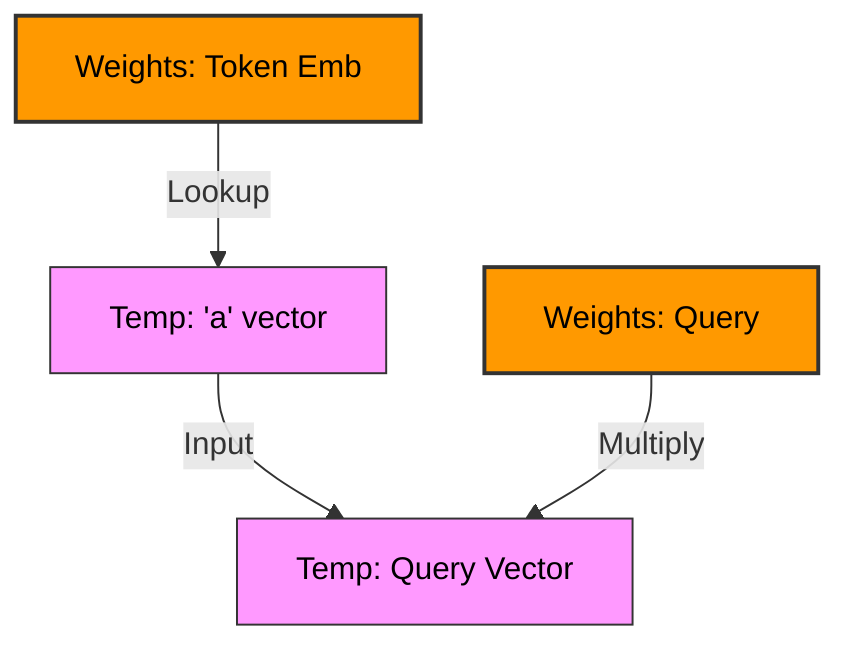
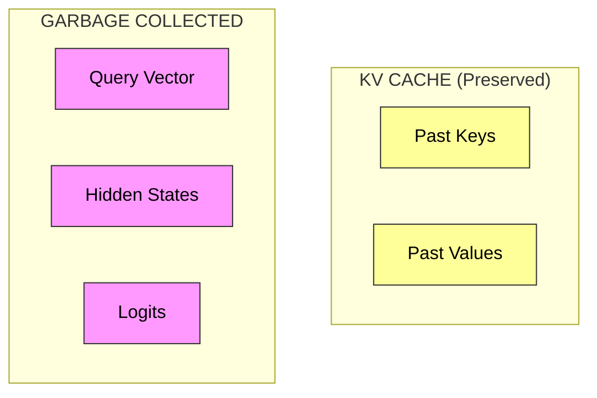
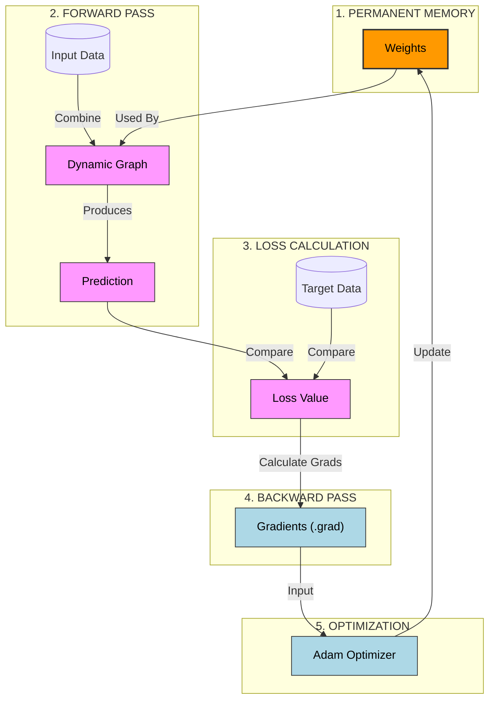

# The MicroGPT Dynamic Computation Graph

This document visualizes how `MicroGPT` builds its computation graph on the fly ("Define-by-Run").

## Legend
- **Orange/Red Rectangles**: Permanent Weights (The "Brain"). These persist throughout the entire life of the program.
- **Pink/Yellow Ovals**: Temporary Values (The "Thoughts"). These are created for a single token and destroyed immediately after (or cached).

## 1. The Components

```mermaid
graph TD
    subgraph Permanent_Memory ["PERMANENT MEMORY (Weights)"]
        direction TB
        WTE["Token Embeddings (wte)"]
        WPE["Pos Embeddings (wpe)"]
        WQ["Query Weights (attn_wq)"]
        WK["Key Weights (attn_wk)"]
        WV["Value Weights (attn_wv)"]
    end

    subgraph Temporary_Graph ["TEMPORARY GRAPH (Per Token)"]
        direction TB
        x_in["Input x"]
        q_vec["Query Vector"]
        k_vec["Key Vector"]
        v_vec["Value Vector"]
        logits["Logits (Output)"]
    end

    %% High Contrast Orange for Dark Mode
    style WTE fill:#ff9900,stroke:#333,stroke-width:2px,color:#000
    style WPE fill:#ff9900,stroke:#333,stroke-width:2px,color:#000
    style WQ fill:#ff9900,stroke:#333,stroke-width:2px,color:#000
    style WK fill:#ff9900,stroke:#333,stroke-width:2px,color:#000
    style WV fill:#ff9900,stroke:#333,stroke-width:2px,color:#000

    style x_in fill:#f9f,stroke:#333,color:#000
    style q_vec fill:#f9f,stroke:#333,color:#000
    style k_vec fill:#f9f,stroke:#333,color:#000
    style v_vec fill:#f9f,stroke:#333,color:#000
    style logits fill:#f9f,stroke:#333,color:#000
```

## 2. Construction (Single Token Pass)
When `gpt()` runs for a token, it temporarily links the **Permanent Weights** to new **Temporary Values**.

## 3. Training vs Inference Lifecycle

### Training (Forward + Backward)
1.  **Build**: We build the full graph for a sequence (e.g., 32 tokens).
2.  **Hold**: We keep *everything* in memory.
3.  **Backward**: We traverse the graph from `Loss` back to `Weights`, calculating gradients.
4.  **Update**: We modify the `Weights` (Orange Nodes).
5.  **Destroy**: We delete all Temporary/Pink Nodes.

### Inference (Generation)
1.  **Build**: We build the graph for *one* token.
2.  **Predict**: We get the next token.
3.  **Cache**: We save *only* the Key/Value vectors (Yellow) to the KV Cache.
4.  **Destroy**: We delete everything else (q, logits, hidden states) immediately.

## 4. The Training Process (Step-by-Step)
This diagram illustrates how the optimizer interacts with the weights.

